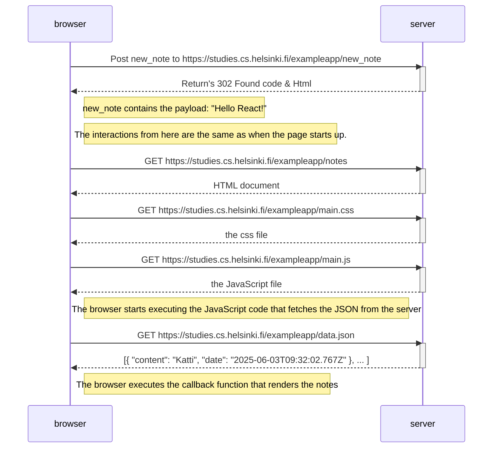

```mermaid
sequenceDiagram
    participant browser
    participant server

    browser->>server: Post new_note to https://studies.cs.helsinki.fi/exampleapp/new_note
    activate server
    server-->>browser: Return's 302 Found code & Html
    deactivate server

    Note right of browser: new_note contains the payload: "Hello React!"

    Note right of browser: The interactions from here are the same as when the page starts up.

      browser->>server: GET https://studies.cs.helsinki.fi/exampleapp/notes
    activate server
    server-->>browser: HTML document
    deactivate server

    browser->>server: GET https://studies.cs.helsinki.fi/exampleapp/main.css
    activate server
    server-->>browser: the css file
    deactivate server

    browser->>server: GET https://studies.cs.helsinki.fi/exampleapp/main.js
    activate server
    server-->>browser: the JavaScript file
    deactivate server

    Note right of browser: The browser starts executing the JavaScript code that fetches the JSON from the server


    browser->>server: GET https://studies.cs.helsinki.fi/exampleapp/data.json
    activate server
    server-->>browser: [{ "content": "Katti", "date": "2025-06-03T09:32:02.767Z" }, ... ]
    deactivate server

    Note right of browser: The browser executes the callback function that renders the notes
```