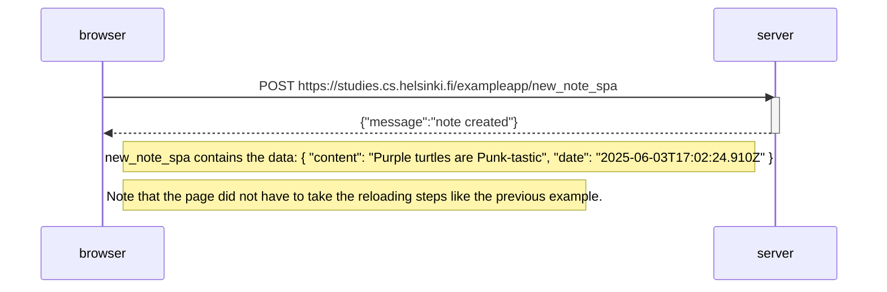

```mermaid
sequenceDiagram
    participant browser
    participant server

    browser->>server: POST https://studies.cs.helsinki.fi/exampleapp/new_note_spa
    activate server
    server-->>browser: {"message":"note created"}    
    deactivate server

    Note right of browser: new_note_spa contains the data: { "content": "Purple turtles are Punk-tastic", "date": "2025-06-03T17:02:24.910Z" }

    Note right of browser: Note that the page did not have to take the reloading steps like the previous example.
```